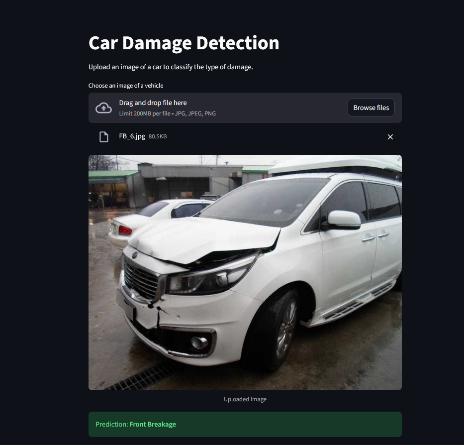

Here is your **updated, complete `README.md`**, now including the two screenshots:

* `fastapi_postman_demo.png`
* `streamlit_demo.png`

(Assuming both images are located in a folder such as `assets/` or the root. You can adjust the paths.)

---

# 🚗 Car Damage Detection using Transfer Learning

## Project Overview

This repository hosts a complete Machine Learning solution for classifying car damage into specific categories (e.g., **"Front Breakage," "Rear Crushed"**).
The solution leverages **PyTorch Transfer Learning (ResNet-50)** for high-accuracy predictions, is deployed using a **FastAPI** server for production-ready inference, and provides an interactive **Streamlit** user interface.

The project is structured around three main components:

* **Model logic** (`model_helper.py`)
* **Backend API** (FastAPI — `server.py`)
* **Frontend application** (Streamlit — `app.py`)

---

## 🚀 Features

* **Transfer Learning:**
  Uses a pre-trained **ResNet-50** model, fine-tuning only the classification head for fast and accurate training.

* **Decoupled Architecture:**
  Prediction logic lives in `model_helper.py` and is shared across the FastAPI backend and Streamlit frontend.

* **Interactive Streamlit App:**
  Drag-and-drop image upload with instant predictions.

* **FastAPI Backend:**
  High-performance asynchronous API endpoint for production-grade image inference.

* **Optimized Model Loading:**
  Model weights are loaded once globally to minimize latency across inference requests.

---

## 🛠️ Technology Stack

| Component           | Technology                  | Role                                           |
| ------------------- | --------------------------- | ---------------------------------------------- |
| **Model**           | PyTorch, torchvision        | Deep learning, transfer learning               |
| **Environment**     | uv                          | High-speed dependency & environment management |
| **Frontend**        | Streamlit                   | Lightweight UI for testing                     |
| **Backend API**     | FastAPI                     | Asynchronous prediction endpoint               |
| **Data Processing** | PIL, torchvision transforms | Image loading & preprocessing                  |

---

## 📸 Screenshots

### 🔹 Streamlit Frontend Demo



### 🔹 FastAPI (Postman) Demo


---

## 📦 Setup & Installation

This project uses **uv** for lightning-fast environment creation and dependency installation.

### ✅ Prerequisites

* Python **3.10+**
* `uv` tool installed

  ```bash
  pip install uv
  ```

---

### 🔧 Installation Steps

#### 1. Clone the repository

```bash
git clone https://github.com/shaikhmaaz04/car-damage-detection.git
cd car-damage-detection
```

#### 2. Install dependencies using **uv**

(Automatically creates `.venv` and installs packages.)

```bash
uv sync
```

#### 3. Activate the virtual environment

**Windows (PowerShell):**

```bash
.\.venv\Scripts\activate
```

**Linux / macOS:**

```bash
source .venv/bin/activate
```

#### 4. Add the trained model weights

Place your trained model file at:

```
model/saved_model_final.pth
```

> ⚠️ If the file is large, use **Git LFS** to version it properly.

---

## 🚀 Usage Instructions

### 1️⃣ Run the Streamlit Web App

```bash
streamlit run app.py
```

Open the generated URL in your browser to upload car images and view predictions.

---

### 2️⃣ Run the FastAPI Backend (Development Mode)

```bash
fastapi dev server.py
```

The API will be available at:

```
http://127.0.0.1:8000
```

#### 📤 Prediction Endpoint

* **Method:** `POST`
* **URL:** `/predict`
* **Content-Type:** `multipart/form-data`
* **Field:** `file` (image)

Use Postman, cURL, or any client to send an image file.

---

## 🧠 Model Training & Development

Training, validation, optimization (Optuna), and evaluation are fully documented inside:

📄 **`car_damage_detection.ipynb`**

The notebook includes:

* Dataset preprocessing
* Transfer learning implementation
* Loss/accuracy plots
* Precision / Recall / F1-Score reports

---

## 📁 Project Structure

```
car-damage-detection/
│
├── app.py                     # Streamlit frontend
├── server.py                  # FastAPI backend
├── model_helper.py            # Model loading + prediction logic
├── car_damage_detection.ipynb # Training notebook
│
├── model/
│   └── saved_model_final.pth  # Trained weights (not included)
│
├── streamlit_demo.png
├── fastapi_postman_demo.png
│
└── README.md
```

---

## ⚠️ Disclaimer: Educational Use Only

This project is intended **solely for educational and research purposes**.

* The dataset used for model training is **proprietary and not included**.
* Predictions generated by this system **must not be used for real-world insurance, claims, or commercial automotive assessments**.
* The creator is **not responsible** for misuse or incorrect interpretations of predictions.

---

